# Understanding main.py - Sakhi WhatsApp Backend

## Overview

[`main.py`](file:///d:/Ottobon/Sakhi-Whatsapp-Backend/main.py) is the **core FastAPI application** that orchestrates the entire Sakhi chatbot system. It handles user registration, onboarding, and most importantly, the intelligent chat routing between different AI models based on query complexity.

---

## Architecture Diagram

```mermaid
graph TB
    User[👤 User Request] --> MainPy[main.py<br/>FastAPI App]
    
    MainPy --> UserProfile[modules/user_profile.py<br/>User Management]
    MainPy --> ModelGateway[modules/model_gateway.py<br/>Semantic Routing]
    MainPy --> Classification[modules/response_builder.py<br/>Message Classification]
    MainPy --> Conversation[modules/conversation.py<br/>Chat History]
    
    ModelGateway --> Route1[Route: SLM_DIRECT<br/>Small Talk]
    ModelGateway --> Route2[Route: SLM_RAG<br/>Simple Medical]
    ModelGateway --> Route3[Route: OPENAI_RAG<br/>Complex Medical]
    
    Route1 --> SLMClient[modules/slm_client.py<br/>Small Language Model]
    Route2 --> RAGFlow[RAG Pipeline]
    Route3 --> RAGFlow
    
    RAGFlow --> SearchHier[search_hierarchical.py<br/>Context Assembly]
    SearchHier --> RAGBase[rag.py<br/>Embeddings]
    SearchHier --> Supabase[supabase_client.py<br/>Database]
    
    Route2 --> SLMClient
    Route3 --> ResponseBuilder[modules/response_builder.py<br/>OpenAI GPT-4]
    
    SLMClient --> Response[📤 Final Response]
    ResponseBuilder --> Response
    
    Supabase --> DB[(Supabase Database<br/>- sections<br/>- section_chunks<br/>- sakhi_faq<br/>- users<br/>- conversations)]
    
    style MainPy fill:#ff6b6b,stroke:#c92a2a,stroke-width:3px,color:#fff
    style ModelGateway fill:#4ecdc4,stroke:#0b7285,stroke-width:2px
    style RAGFlow fill:#95e1d3,stroke:#087f5b,stroke-width:2px
    style Response fill:#ffd93d,stroke:#f59f00,stroke-width:2px
```



---

## Key Components

### 1. **Endpoints** (The API Surface)

#### 🏠 `GET /`
- Health check endpoint
- Returns: `{"message": "Sakhi API working!"}`

#### 👤 `POST /user/register`
- Full user registration with name, email, password, phone
- Creates user profile in database
- **Returns:** `user_id` and user details

#### 💬 `POST /sakhi/chat` ⭐ **MAIN ENDPOINT**
- Handles all chat interactions
- Implements **3-stage onboarding flow**
- Routes to appropriate AI model based on complexity
- **Returns:** Reply, mode, language, YouTube links, infographics

#### 📝 `POST /user/answers`
- Saves bulk user questionnaire responses
- Used for collecting user health data

#### 🔗 `POST /user/relation`
- Updates user's relation status (self/partner/family)

#### 🌍 `POST /user/preferred-language`
- Sets user's preferred language

---

## 2. **The Chat Flow** (Lines 96-335)

### Stage 1: User Resolution & Onboarding


**Onboarding Questions:**
1. **Name:** "What is your name?"
2. **Gender:** "What is your gender? (Male/Female)"
3. **Location:** "What's your location (City/Town)?"
4. **Completion:** Shows beautiful welcome message with `Sakhi_intro.png`

### Stage 2: Message Classification & Routing

```python
# Lines 178-188: Classification
route = model_gateway.decide_route(req.message)  # Semantic routing
classification = classify_message(req.message)    # Language + signal
```

**What happens:**
1. **Model Gateway** analyzes semantic similarity to anchor categories
2. **Classifier** detects language (English/Telugu/Tinglish) and medical relevance

### Stage 3: Hybrid Model Routing

```mermaid
graph LR
    Query[User Query] --> Gateway[Model Gateway<br/>Semantic Analysis]
    
    Gateway -->|Similarity > 0.75| Route1[🔵 SLM_DIRECT<br/>No RAG needed]
    Gateway -->|Medical Simple| Route2[🟢 SLM_RAG<br/>RAG + SLM]
    Gateway -->|Complex/Default| Route3[🟡 OPENAI_RAG<br/>RAG + GPT-4]
    
    Route1 --> SLM1[Small talk response]
    Route2 --> RAG2[Retrieve context]
    Route3 --> RAG3[Retrieve context]
    
    RAG2 --> SLM2[Generate with SLM]
    RAG3 --> GPT4[Generate with GPT-4]
    
    SLM1 --> Final1[General mode response]
    SLM2 --> Final2[Medical mode + metadata]
    GPT4 --> Final3[Medical mode + metadata]
```



#### **Route 1: SLM_DIRECT** (Lines 202-222)
- **When:** Casual greetings, thanks, general chat
- **Process:** Direct to Small Language Model
- **No RAG:** Skips knowledge base retrieval
- **Response:** General conversational reply

#### **Route 2: SLM_RAG** (Lines 225-271)
- **When:** Simple medical queries, facility info
- **Process:**
  1. Retrieve context via `hierarchical_rag_query()`
  2. Assemble context via `format_hierarchical_context()`
  3. Generate response using SLM with context
  4. Extract YouTube links & infographics from FAQ results
- **Response:** Medical reply + metadata (YouTube, infographic)

#### **Route 3: OPENAI_RAG** (Lines 294-335)
- **When:** Complex medical queries, emergency symptoms, default
- **Process:**
  1. RAG retrieval (hierarchical + FAQ)
  2. GPT-4 generation with structured prompts
  3. Special formatting for follow-up questions
- **Response:** Medical reply + follow-ups + metadata

---

## 3. **Connected Files & Their Roles**

### 📁 **modules/** Directory

| File | Purpose | Used For |
|------|---------|----------|
| [`user_profile.py`](file:///d:/Ottobon/Sakhi-Whatsapp-Backend/modules/user_profile.py) | User CRUD operations | Create, update, fetch user profiles |
| [`model_gateway.py`](file:///d:/Ottobon/Sakhi-Whatsapp-Backend/modules/model_gateway.py) | **Semantic routing** | Decide which AI model to use |
| [`slm_client.py`](file:///d:/Ottobon/Sakhi-Whatsapp-Backend/modules/slm_client.py) | Small Language Model client | Generate responses for Routes 1 & 2 |
| [`response_builder.py`](file:///d:/Ottobon/Sakhi-Whatsapp-Backend/modules/response_builder.py) | OpenAI GPT-4 integration | Classify messages, generate medical responses |
| [`conversation.py`](file:///d:/Ottobon/Sakhi-Whatsapp-Backend/modules/conversation.py) | Chat history management | Save/retrieve conversation history |
| [`user_answers.py`](file:///d:/Ottobon/Sakhi-Whatsapp-Backend/modules/user_answers.py) | Questionnaire responses | Save bulk user answers |
| [`text_utils.py`](file:///d:/Ottobon/Sakhi-Whatsapp-Backend/modules/text_utils.py) | Text processing utilities | Truncate responses to 1024 chars |

### 📁 **Root Directory Files**

| File | Purpose | How main.py Uses It |
|------|---------|---------------------|
| [`search_hierarchical.py`](file:///d:/Ottobon/Sakhi-Whatsapp-Backend/search_hierarchical.py) | **RAG implementation** | `hierarchical_rag_query()` - retrieve relevant docs<br/>`format_hierarchical_context()` - assemble context |
| [`rag.py`](file:///d:/Ottobon/Sakhi-Whatsapp-Backend/rag.py) | Embedding generation | Used by search_hierarchical for vector search |
| [`supabase_client.py`](file:///d:/Ottobon/Sakhi-Whatsapp-Backend/supabase_client.py) | Database connection | RPC calls to Supabase functions |

---

## 4. **Data Flow Example**

Let's trace a medical query **"What is IVF?"**:


---

## 5. **Key Features & Innovations**

### 🎯 **Hybrid Architecture**
- **3-tier routing** based on semantic similarity
- Optimizes cost (SLM cheaper) vs quality (GPT-4 better for complex)
- Dynamic routing configured in [`model_gateway.py`](file:///d:/Ottobon/Sakhi-Whatsapp-Backend/modules/model_gateway.py)

### 🧩 **Context Assembly**
- Merges hierarchical documents + FAQ results
- Preserves document structure with header paths
- Extracts metadata (YouTube links, infographics)
- See [`search_hierarchical.py:62-105`](file:///d:/Ottobon/Sakhi-Whatsapp-Backend/search_hierarchical.py#L62-L105)

### 🌍 **Multi-language Support**
- Detects English, Telugu, Tinglish (Roman Telugu)
- Responds in user's detected language
- Language detection in [`response_builder.py:44-75`](file:///d:/Ottobon/Sakhi-Whatsapp-Backend/modules/response_builder.py#L44-L75)

### 💾 **Conversation Memory**
- Stores all user messages and Sakhi replies
- Retrieves last 5 messages for context
- Enables continuity in conversations

### 📊 **State Machine Onboarding**
- Progressive data collection (name → gender → location)
- State tracked via NULL checks on user profile
- Beautiful welcome message on completion

---

## 6. **Database Schema (Supabase)**

The application interacts with these tables:


---

## Summary

**`main.py`** is the orchestration layer that:

1. ✅ Exposes FastAPI endpoints for user management and chat
2. ✅ Implements state-machine based onboarding
3. ✅ Routes queries to optimal AI model using semantic similarity
4. ✅ Coordinates RAG retrieval and context assembly
5. ✅ Manages conversation history and user profiles
6. ✅ Returns structured responses with metadata (YouTube, infographics)

It connects **10+ modules** and orchestrates a sophisticated hybrid AI system with intelligent routing, hierarchical RAG, and multi-language support! 🚀
